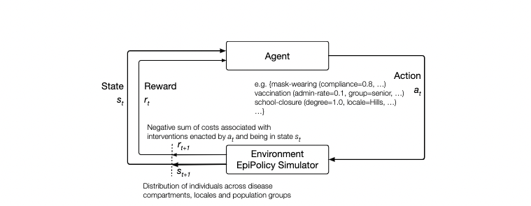

# Planning Multiple Epidemic Interventions with Reinforcement Learning

PyTorch implementation of the paper:

- **Title**: Planning Multiple Epidemic Interventions with Reinforcement Learning 
<!-- - Authors:  -->
<!-- - Conference:  -->
<!-- - More details:  -->

### Abstract 

Combating an epidemic entails finding a plan that describes when and how to apply different interventions, such as mask-wearing mandates, vaccinations, school or workplace closures. An optimal plan will curb an epidemic with minimal loss of life, disease burden, and economic cost. Finding an optimal plan is an intractable computational problem in realistic settings. Policy-makers, however, would greatly benefit from tools that can efficiently search for plans that minimize disease and economic costs especially when considering multiple possible interventions over a continuous and complex action space given a continuous and equally complex state space. We formulate this problem as a Markov decision process. Our formulation is unique in its ability to represent multiple interventions over any disease model defined by ordinary differential equations. We illustrate how to effectively apply state-of-the-art actor-critic reinforcement learning algorithms (PPO and SAC) to search for plans that minimize overall costs. We empirically evaluate the learning performance of these algorithms and compare their performance to hand-crafted baselines that mimic plans constructed by policy-makers. We find that PPO outperforms baselines. Our work confirms the viability of a computational approach to support policy-makers with epidemic intervention planning. 



### Requirements 
- Python 3.8/3.9 
- Pytorch
- stable-baselines3
- gym==0.21
- Numba

### How To Run 

``` 
# clone project
git clone https://github.com/Nikunj-Gupta/Planning-Multiple-Epidemic-Interventions-with-Reinforcement-Learning.git

# Run PPO/SAC on multiple scenarios in EpiPolicy 

python3 <RL_algorithm>.py —-gym-id <scenario_name> 

# Example: run PPO on SIR_A 
python3 ppo_kernel.py -—gym-id SIR_A

# Example: run SAC on SIRV_B 
python3 sac_kernel.py -—gym-id SIRV_B 

# To reproduce the results in the paper --> Refer/Use plots.ipynb 
```

Note: We used the following seeds: 0, 1, 2, 3 

##### Other Options for PPO 

```
python3 ppo_kernel.py —gym-id <SCENARIO> 
[--exp-name] [--learning-rate] [--seed]
[--total-timesteps] [--torch-deterministic] 
[--cuda][--track] [--wandb-project-name] 
[--wandb-entity] [--capture-video] 
[--policy_plot_interval] [--num-envs] 
[--num-steps] [--anneal-lr] [--gae]
[--gamma][--gae-lambda][--num-minibatches]
[--update-epochs][--norm-adv][--clip-coef]
[--clip-vloss][--ent-coef][--vf-coef]
[--max-grad-norm][--target-kl] 
```
##### Other Options for SAC 

```
python3 sac_kernel.py —gym-id <SCENARIO> 
[--exp-name] [--learning-starts] [--seed]
[--total-timesteps] [--target-entropy-scale] 
[--train-freq][--gradient-steps] 
```
##### To reproduce the baselines 
Code for baselines is in `plots.ipynb`

### Acknowledgements 
We acknowledge [[https://github.com/vwxyzjn/cleanrl]](https://github.com/vwxyzjn/cleanrl) for a Clean Implementation of RL Algorithms 
